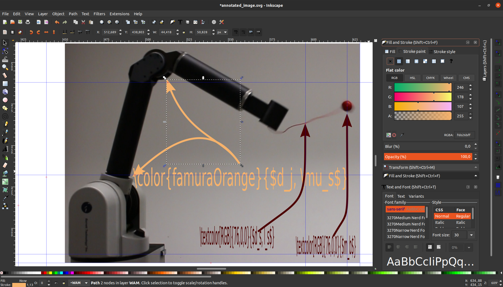
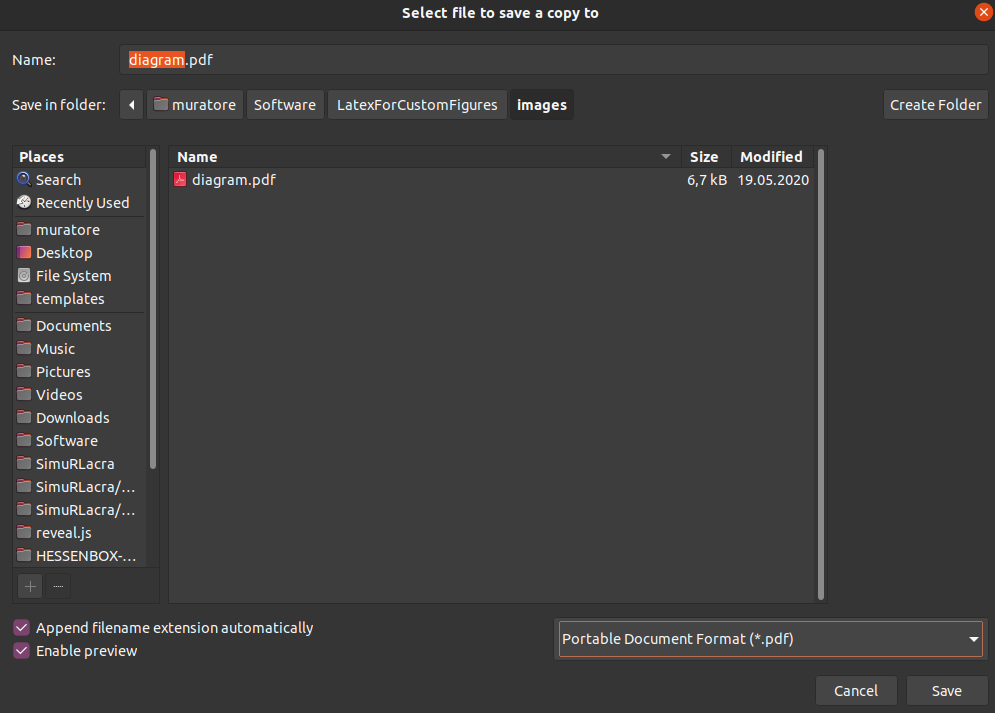
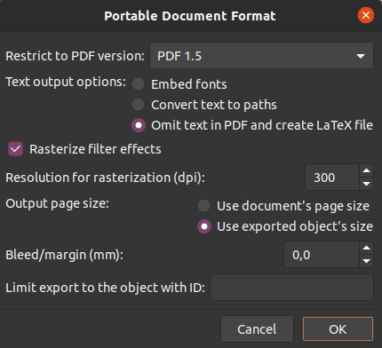
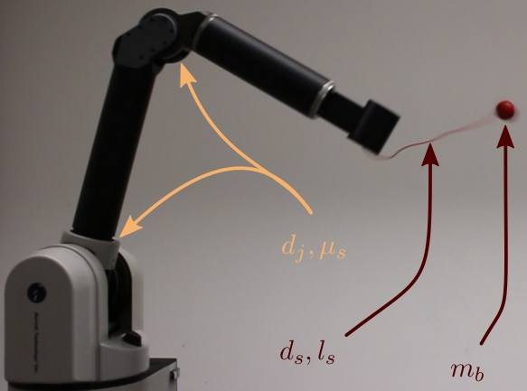
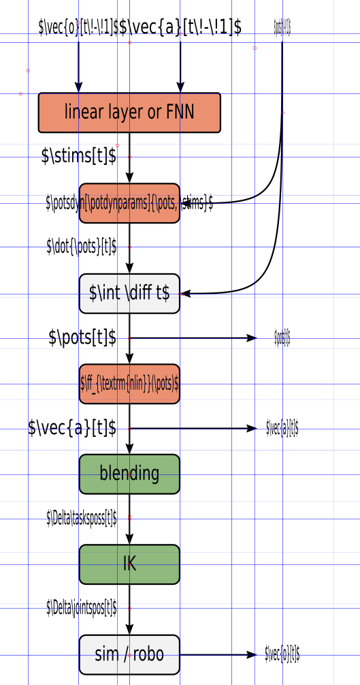
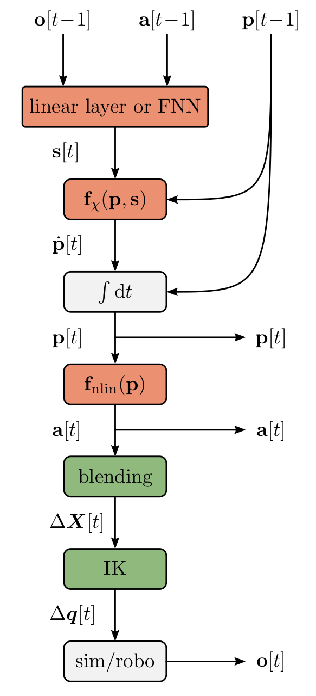
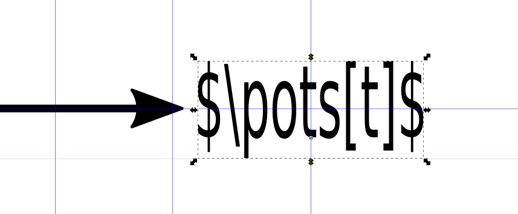

# BellaFigura
A workflow showing how to combine [Inkscape](https://inkscape.org/de/) and LaTeX to obtain figures that match your document better

## Why?

First, writing this tutorial is a nice way to procrastinate. Aside form this, I just can't take another badly formatted figure where the font does not match the main text. Seriously, nobody likes them. Moreover, figures and tables are the only thing that 99% of people read in your paper. It's sad, but true. If it is obvious that you don't put in the effort to make the important elements shine, what about the maybe even more critical details of your work? Finally, it is not hard to get this done nicely.

### Why Inkscape?

[Inkscape](https://inkscape.org/de/) is a great and (rather) easy to use program available on linux, Windows, and macOS. But most importantly, it lets us save our figures in pdf and pdf_tex files, thereby separating the graphical content from the text. We will see later why this is important.

### Why Not Tikz?

Indeed, the things I will show in this tutorial can also be achieved using [Tikz](https://en.wikibooks.org/wiki/LaTeX/pgf/TikZ). But, and this is a big "but", Tikz has a steep learning curve, and you will be in the majority of cases at least as fast when using a graphical interface. Moreover, I believe that the results you would obtain when you use a text-based tool to create visual content would look rigid, the same way presentations made with beamer look.


## How?

I assume that you a have LaTeX and Inkscape set up. The following two examples will show
1. how to annotate an image with arrows and (default) math symbols, both colored in custom colors (defined in two different ways),
2. how to create a schematic using elements designed in Inkscape combined with text and math from latex. The latter also demonstrates that you can used nested command definitions, i.e. you can put you favorite macros right into the [svg](https://en.wikipedia.org/wiki/Scalable_Vector_Graphics) file that you are editing in Inkscape.
3. how to plot data (e.g., with [pyplot](https://matplotlib.org/stable/tutorials/introductory/pyplot.html)) such that you can integrate the result with your LaTeX document. 

### Example 1: Annotated Image

When you open `images/annotated_image.svg` in Inkscape it looks like this

<p align="center">

</p>

Feel free to open it and explore. There are a few arrows and text elements as well as a picture in the background (you can toggle which appears above the other).

The second example will provided more details on how to place the text (anchors), since that is the only part where it can get a little bit tricky. For now, let's assume you are done with your changes want to save. I strongly recommend to save a copy, such that you keep working in the svg file. Hit `File->Save a Copy...` and choose a file name you like. Make sure to select **pdf** in the bottom right drop down menu.

<p align="center">

</p>

After clicking on `Save`, Inkscape wants to know more details on how to save your file. Select the options as displayed below. There is a subtle pitfall here. We select `Use exported object's size` to not make out export as large as the whole Inkscape canvas. However this meas, that if you only select one object and then save, it will only save that object. I know this is crazy news. So make sure to select nothing or all objects.

<p align="center">

</p>

This actually saved two files: a pdf and a pdf_tex file. The pdf_tex file is essentially just a collection of LaTeX commands and directly loaded via the `\input` command. Thus, you will can use the typical LaTeX error prompts to debug your files if necessary. Make sure your required custom commands are defined before importing the pdf_tex file. This also includes loading the required packages.
The images width can be controlled by placing `\def\svgwidth{X.Y\columnwidth}` before the input statement. I recommend using `\columnwidth` as a scaling factor since it works with single and two column documents.

Your LaTeX document could look like this
```
\documentclass{WHATEVER}

\usepackage{graphicx} % necessary for figures in pdf_tex format
\graphicspath{{./images/}} % tell the package where too look; necessary when using subfolders
\usepackage[usenames,svgnames,table,rgb,dvipsnames]{xcolor} % necessary for figures in pdf_tex format

...

\begin{document}

...

\begin{figure}[hb]
	\centering
	\def\svgwidth{0.4\columnwidth} % there is no \svgheight command
	\input{images/NAME.pdf_tex} % use \input not \includegraphics
	\caption{%
		CAPTION.
	}%
	\label{fig_LABEL}
\end{figure}

...

\end{document}
```

Good, now you are ready to compile. Since LaTeX is a beautiful piece of software that aged very well, you will never encounter any problems.
There result looks like this

<p align="center">

</p>

### Example 2: Schematic with Custom Commands

Now we discover the true strength and the most annoying detail of this approach. In the picture below you can see that I used a lot of helping lines to arrange the boxes in an equidistant fashion, and that I used typical LaTex commands like `\vec` as well as custom commands like `\stims` ect. These are defined in the preamble of the tex file.

<p float="left">
  
  
</p>

Pretty exciting, right? There is one thing which was quite intuitive to me in the beginning. The text is displayed according to the the **anchor** which is visualized by the little square below the "t" in the next image.

<p align="center">

</p>

It is best to align your text boxes with their anchors using helper lines (the blue ones). Be aware that you can control the placement of the anchor (left, center, right) by hitting on these buttons

<p align="center">

</p>

which can be found in the top row. You don't find them? Most likely you did not select the right menue. Go over the text box you want to edit and hit `F8`. There is also a `Text and Font` panel that comes up when pressing `Ctrl + Shift + t`. See [here](https://graphicdesign.stackexchange.com/questions/116197/how-do-you-move-the-text-anchor-in-inkscape) if you have questions left.

Let me give you one practical example of the achor placement. Look at the text in the boxed above. The helper lines mark the center. Next, you move the anchor on top of the center (see here for [snapping to objects in Inkscape](https://alpha.inkscape.org/vectors/www.inkscapeforum.com/viewtopic2cd0.html?t=33101)). But when you now compile, the text appears vertically too high. I recommend giving it two ticks down using the moment menue (`F1`) and the downwards arrow - et voila.

Have fun creating some beautiful figures.

## What About Plots?

Most plotting libraries have an option to save [pgf](https://en.wikipedia.org/wiki/pgf/TikZ) files. These files basically contain LaTeX commands and a reference to the separately saved image of your plot (usually a [png](https://en.wikipedia.org/wiki/Portable_Network_Graphics) file). Thus, you again get a visually clean integration.

```
\begin{figure}
	% ... as usual ...
	\input{PATH_TO/NAME.pgf}
	% ... as usual ...
\end{figure}
```
Note that within `NAME.pgf` sth like `NAME-img0.png` is loaded. Therefore, your Tex compiler needs to be able to find the file. In case of pdfLaTeX, I recommed adding
```
\usepackage{graphicx}
\graphicspath{{./images/}{./plots/}} % necessary when using subfolders
\usepackage[usenames,svgnames,table,rgb,dvipsnames]{xcolor}
```
to your preamble. From my experience LuaLaTeX is a bit better at finding your files in subfolders, but this is not the scope here.

There is an annoying downside to using pgf files: **scaling**. Since most of the LaTeX commands in the pgf file rely on absolute positioning and your documents font is most likely different than what your plotting library uses, things might not fit your document. Your will quickly discover that scaling is hindsight is pretty annoying. I recommend creating, and thus saving, the figure in the correct size right away. This way you will also notice when your plotting library has issues arranging the text, i.e. when it would look too packed or small in the paper.
For `matplotlib.pyplot` I defined some (absolutely questionable) figure sizes that I then just set when creating the figure.
```
# Figure sizes (width, height) [inch]
figsize_IEEE_1col_18to10 = (3.5, 3.5 / 18 * 10)
figsize_IEEE_2col_18to10 = (7.16, 7.16 / 18 * 10)
figsize_IEEE_1col_square = (3.5, 3.5)
figsize_IEEE_2col_square = (7.16, 7.16)
figsize_JMLR_warpfig = (2.5, 2.4)
```
In your Python script file it would look like this
```
import os
import matplotlib.pyplot as plt

# Experiment with constrained_layout=True or constrained_layout=False
fig, ax = plt.subplots(1, figsize=figsize_IEEE_2col_18to10, constrained_layout=True)

# Do sth meaningful
# ...

for fmt in ["pdf", "pgf", "png"]:
	# Create a subsolder for your plots
	os.makedirs(os.path.join(PATH_TO, "plots"), exist_ok=True)
	# Save it for every file type
	fig.savefig(os.path.join(PATH_TO, "plots", f"NAME.{fmt}"), pi=300)
```